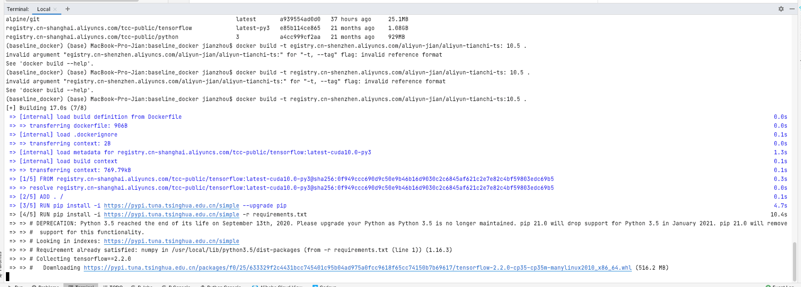
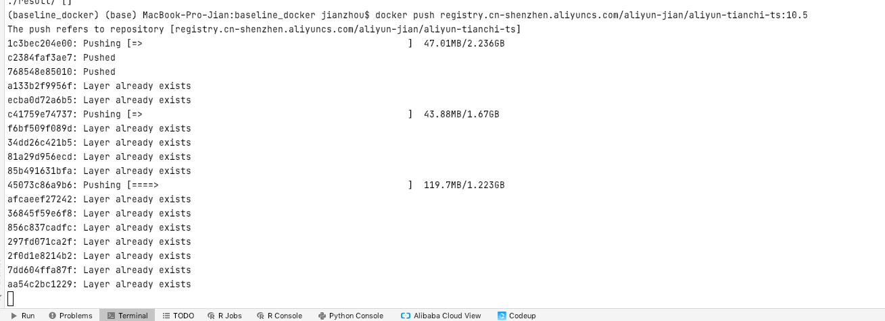

### Feb 22th 打卡学习记录

一开始把Aliyun和Docker账号搞混了，出了很多模型奇妙的bug \
最后还是好不容易在最后关头跑通了。。太难了我的天。

[docker天池的手把手教学](https://tianchi.aliyun.com/competition/entrance/231759/tab/226)

build image via pycharm terminal 

push image to my registry

成功记录
score: -16

### Feb 26th 打卡学习记录

因为数据很多，所以我们使用tsfresh来生成feature，
类似于一个自动的feature engineering，
然后套入了模型。

后续思路是使用transformer来进行预测。

